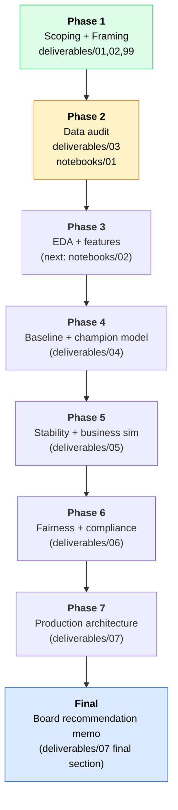

# Loan Risk — McKinsey-style Credit Risk Engagement

**Persona**: Senior Data Scientist at McKinsey / QuantumBlack, embedded in an 8-week engagement for **NovaLend** — a hypothetical $10B US consumer lender deciding whether to modernize their legacy credit scorecard. This repo is the **technical workstream** of that engagement.

**Dataset**: [Home Credit Credit Risk Model Stability](https://www.kaggle.com/competitions/home-credit-credit-risk-model-stability) (Kaggle 2024) — the analytical stand-in for NovaLend's loan-decisioning data. 26 GB; runs on Kaggle Notebooks (no local download).

**Status as of 2026-05-17**: Phase 1 (scoping + framing) complete · Phase 2 (data audit) infrastructure built, execution pending.

> ❗ **New here?** Open [CODEBASE.md](CODEBASE.md) first. It's the file-by-file map of what's in this repo, what's a client deliverable, what's working code, and what's paste-and-delete.

---

## What this repo is

A real, in-progress consulting engagement portfolio. By the time it's done, it will contain:

1. **Client-facing deliverables** — board memo + supporting docs (currently in `deliverables/`)
2. **Engineering code** — data loaders, audit functions, modeling pipeline, evaluation (currently in `src/`)
3. **Analysis notebooks** — the runnable analyses that produced the findings (in `notebooks/`)
4. **A personal interview-prep toolkit** — methodology reference + worked examples (in `interview_prep/`, side resource)

The point: build the *real work* so you can defend every decision in an interview from substance, not memorization.

---

## How the engagement is structured

```
Phase 0  Setup                                ✅ done
Phase 1  Scoping + framing                    ✅ done    (deliverables/01, 02, 99)
Phase 2  Data audit                           ⏳ infra built, awaiting execution
Phase 3  Feature engineering + baseline       📋 next
Phase 4  Champion model (LightGBM)            📋
Phase 5  Stability + business simulation      📋
Phase 6  Fairness audit + compliance map      📋
Phase 7  Production architecture              📋
Phase 8  Board recommendation memo            📋
```

The strategic playbook for Phases 0–10 lives in [credit_risk_system_roadmap.md](credit_risk_system_roadmap.md).

---

## End-to-end workflow



---

## How to use this repo

### If you're here to read the engagement (interviewer, reviewer, future you)

Start with [deliverables/](deliverables/). It reads top-to-bottom as an in-progress consulting engagement.

- [01_engagement_charter.md](deliverables/01_engagement_charter.md) — client, scope, success criteria
- [02_problem_framing.md](deliverables/02_problem_framing.md) — the decision sentence + target rationale + hypotheses
- [03_data_understanding.md](deliverables/03_data_understanding.md) — eyeballing findings; runtime findings will fill in after Phase 2 execution
- [99_decisions_log.md](deliverables/99_decisions_log.md) — every non-obvious decision with rationale + rejected alternatives

### If you're here to drive the engagement forward (you, currently)

The dev loop:

```
   ┌──────────────────┐
   │  VSCode (local)  │  ← edit src/, deliverables/*.md, notebooks/*.py
   └────────┬─────────┘
            │ git push
            ▼
   ┌──────────────────┐
   │  GitHub          │  Robot0920/loan_May
   └────────┬─────────┘
            │ git pull (from inside Kaggle)
            ▼
   ┌──────────────────┐
   │  Kaggle Notebook │  data mounted at /kaggle/input/...
   └──────────────────┘  ← run audit / EDA / models here
```

See [data/README.md](data/README.md) for the Kaggle setup.

### If you're here to interview-prep

Read [interview_prep/00_consulting_methodology.md](interview_prep/00_consulting_methodology.md) — the 5-module methodology toolkit (goal decomposition / data understanding / target selection / EDA design / insight generation). [interview_prep/01_worked_examples.md](interview_prep/01_worked_examples.md) has worked examples on three opener prompts.

**Don't fake the technical depth in interviews.** Talk about the project work instead.

---

## Folder structure (one-line each)

| Folder / file | Role | Audience |
|---|---|---|
| [deliverables/](deliverables/) | Client-facing engagement artifacts | CRO, Board, OCC, compliance |
| [src/](src/) | Engineering code (data loaders, audit, modeling pipeline) | Internal team |
| [notebooks/](notebooks/) | Analysis scripts (`.py` files with `# %%` cells) | Internal team |
| [data/](data/) | Data folder — gitignored; mounts from Kaggle | — |
| [interview_prep/](interview_prep/) | Personal methodology toolkit + worked examples | You |
| [credit_risk_system_roadmap.md](credit_risk_system_roadmap.md) | Strategic 10-phase playbook | You, internal team |
| [README.md](README.md) | This file | First-time reader |
| [CODEBASE.md](CODEBASE.md) | **File-by-file map** with keep/paste-delete labels | First-time reader, refactor sessions |

Full inventory with deeper notes per file: see [CODEBASE.md](CODEBASE.md).

---

## Setup (one-time)

```bash
# 1. Clone (you already did)
cd loan_risk

# 2. (Optional) local venv — only if you want to run linters / format code locally
python3 -m venv .venv && source .venv/bin/activate
pip install -r requirements.txt

# 3. Kaggle setup — see data/README.md
#    Short version:
#    - Sign up at kaggle.com
#    - Join: https://www.kaggle.com/competitions/home-credit-credit-risk-model-stability
#    - New notebook → Add Input → attach the Home Credit Credit Risk Model Stability dataset
#    - Paste the bootstrap cell from notebooks/01_data_audit.py (Cell 0) to clone this repo into Kaggle
```

---

## What's NOT this repo

- Not a Kaggle leaderboard chase. Stability metric matters, but the point is the *workflow*.
- Not a turnkey production system. Deployment files are skeletons to discuss in interviews, not run a real lender.
- Not legal / compliance advice. SR 11-7, ECOA, NIST references are interview talking points, not regulatory guidance.

---

## References

The full reference list with what to read vs. skip lives in [credit_risk_system_roadmap.md](credit_risk_system_roadmap.md#phase-3--reference-code-strategy). Quick top picks:

- **Dataset & starter**: [Home Credit 2024 competition](https://www.kaggle.com/competitions/home-credit-credit-risk-model-stability) · [jetakow's starter notebook](https://www.kaggle.com/code/jetakow/home-credit-2024-starter-notebook)
- **Regulator-facing**: Federal Reserve SR 11-7, OCC bulletin 2011-12, ECOA / Regulation B
- **Fairness tooling**: [Fairlearn](https://fairlearn.org/), [AIF360](https://aif360.readthedocs.io/), [InterpretML](https://github.com/interpretml/interpret)
- **MLOps tooling**: [MLflow](https://mlflow.org/), [Evidently AI](https://github.com/evidentlyai/evidently), [Optuna](https://optuna.org/)
