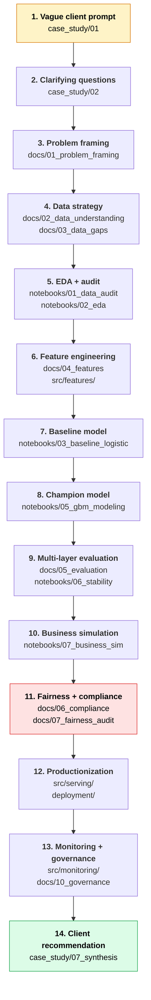

# Loan Risk — Technical Case Study Practice Repo

**Persona**: You are a junior data scientist embedded in a consulting engagement (McKinsey / QuantumBlack-style). A client has hired your firm because their loan book is bleeding money in a way their existing scorecard didn't catch. Your job over the next two weeks is to figure out what's going on and recommend what to do about it.

**Repo purpose**: This is an interview-prep sandbox. It's organized so you can rehearse the *entire* data scientist workflow — from a vague client prompt all the way through deployment and regulator-defensible insights — using a single real dataset (Home Credit Credit Risk Model Stability, Kaggle 2024).

**Difficulty**: Mid-hard. The case is realistic enough that "the right answer" is genuinely contested at several points. The dataset is messy, multi-table, temporally drifty, and the success metric is *stability* not just accuracy — which forces you to make tradeoffs that map onto real production credit modeling.

---

## How to use this repo

There are three ways to run it, depending on what you're practicing:

### Mode 1 — Pure interview drill (1–2 hours)
Open [case_study/01_initial_prompt.md](case_study/01_initial_prompt.md). Read the vague opener. Set a 90-minute timer. Work through clarifying questions → approach → quant drill → synthesis *without* peeking at the follow-ups in `03_*` or the rubric in `05_*`. Then grade yourself against [case_study/05_evaluation_rubric.md](case_study/05_evaluation_rubric.md).

### Mode 2 — Full end-to-end build (2 weeks)
Follow the day-by-day plan in [credit_risk_system_roadmap.md](credit_risk_system_roadmap.md) (Phase 10). Each day's work fills in one part of `docs/`, `notebooks/`, or `src/`. By day 14 you have a defensible end-to-end project to talk about.

### Mode 3 — Workflow-only walkthrough (1 day per phase)
You don't need to do all 14 days. Pick a phase you want to drill — e.g., "feature engineering for stability" or "fairness audit" — and build only that piece. Each `docs/` file is a self-contained mini-case.

---

## The case study layer (the interview part)

This is what makes this repo different from a Kaggle starter. Real consulting / DS interviews don't hand you a clean problem statement — they hand you a *vague* one and watch how you scope it. The `case_study/` folder simulates that.

| File | What it is | When to read it |
|---|---|---|
| [01_initial_prompt.md](case_study/01_initial_prompt.md) | The vague client opener — one paragraph, deliberately under-specified | Start here. Don't read anything else first. |
| [02_clarifying_questions.md](case_study/02_clarifying_questions.md) | The clarifying questions a strong candidate would ask, and the answers the interviewer would give | After you've taken your own shot at scoping |
| [03_follow_up_prompts.md](case_study/03_follow_up_prompts.md) | Progressive deepening drills — interviewer pushes you into data strategy, modeling, evaluation, deployment | After you've laid out an initial approach |
| [04_curveballs.md](case_study/04_curveballs.md) | "What if regulators audit you tomorrow?" / "What if your boss wants neural nets?" — the twists that test seniority | When the basic case feels too easy |
| [05_evaluation_rubric.md](case_study/05_evaluation_rubric.md) | What a senior interviewer is actually scoring on. Five dimensions, anchored | After your practice attempt, to self-grade |
| [06_estimation_drills.md](case_study/06_estimation_drills.md) | Back-of-envelope quant: "if our default rate is 3% and our average loan is $15k, what's the breakeven model accuracy?" | When you want to sharpen the math reflex |
| [07_synthesis_template.md](case_study/07_synthesis_template.md) | How to close: 90-second exec summary in CEO-grade language | The hardest skill — practice this last |

---

## The end-to-end data scientist workflow

This is the workflow your repo walks through. Each box maps to one or more files in `docs/`, `notebooks/`, or `src/`.



---

## The interview flow (what to rehearse)

Real cases bounce between depth and breadth. The interviewer pulls you into a deep dive, then yanks you back to scope, then drops a curveball. You're being tested on whether you can hold all of it simultaneously.


---

## Repo structure

```
loan_risk/
├── README.md                          ← you are here
├── credit_risk_system_roadmap.md      ← strategic playbook (2-week plan + every key decision)
│
├── case_study/                        ← INTERVIEW LAYER — vague-to-drilled prompts
│   ├── 01_initial_prompt.md           ← the opener
│   ├── 02_clarifying_questions.md
│   ├── 03_follow_up_prompts.md        ← progressive drills
│   ├── 04_curveballs.md               ← the twists
│   ├── 05_evaluation_rubric.md        ← how you'd be scored
│   ├── 06_estimation_drills.md        ← back-of-envelope math
│   └── 07_synthesis_template.md       ← the close
│
├── docs/                              ← CONSULTING DELIVERABLES — fill these in as you go
│   ├── 01_problem_framing.md
│   ├── 02_data_understanding.md
│   ├── 03_data_gaps.md
│   ├── 04_features.md
│   ├── 05_evaluation.md
│   ├── 06_compliance.md               ← SR 11-7 / ECOA / NIST AI RMF
│   ├── 07_fairness_audit.md
│   ├── 08_security.md
│   ├── 09_risk_register.md
│   ├── 10_governance.md
│   ├── 11_future_work.md
│   ├── 12_ab_test_design.md
│   └── 99_decisions_log.md            ← running log of every non-obvious choice + reasoning
│
├── data/                              ← gitignored except READMEs
│   ├── raw/                           ← Kaggle download lands here
│   ├── interim/                       ← joined / pre-feature
│   ├── processed/                     ← model-ready feature matrices
│   ├── external/                      ← macro / public data you add
│   └── README.md                      ← download + schema notes
│
├── notebooks/                         ← exploratory + reproducible analyses
│   ├── 01_data_audit.ipynb
│   ├── 02_eda.ipynb
│   ├── 03_baseline_logistic.ipynb
│   ├── 04_feature_engineering.ipynb
│   ├── 05_gbm_modeling.ipynb
│   ├── 06_stability_analysis.ipynb
│   ├── 07_business_simulation.ipynb
│   ├── 08_fairness_audit.ipynb
│   ├── 09_shap_analysis.ipynb
│   └── README.md
│
├── src/                               ← production-grade code (mirrors notebook logic)
│   ├── data/                          ← load / validate / join
│   ├── features/                      ← temporal, aggregation, ratio, missingness
│   ├── models/                        ← baseline + champion + stability constraints
│   ├── evaluation/                    ← metrics, stability, business sim, fairness
│   ├── explainability/                ← SHAP + adverse action reasons
│   ├── serving/                       ← FastAPI inference endpoint
│   └── monitoring/                    ← drift + performance jobs
│
├── tests/                             ← unit tests (matters for SR 11-7 implementation verification)
├── deployment/                        ← Dockerfile + compose
├── scripts/                           ← one-shot CLI utilities
├── .gitignore
├── requirements.txt
└── pyproject.toml
```

---

## Setup

```bash
# 1. Clone (you already did)
cd loan_risk

# 2. Create a virtual environment
python3 -m venv .venv && source .venv/bin/activate

# 3. Install dependencies
pip install -r requirements.txt

# 4. Download data from Kaggle
#    See data/README.md for the exact command (needs kaggle API token configured)

# 5. Start with the case study
open case_study/01_initial_prompt.md
```

---

## Where to start, depending on your goal

| Your goal | Open this first |
|---|---|
| Practice for a McKinsey / BCG / QB-style case interview | [case_study/01_initial_prompt.md](case_study/01_initial_prompt.md) |
| Practice the full end-to-end DS workflow | [credit_risk_system_roadmap.md](credit_risk_system_roadmap.md) Phase 10 |
| Sharpen one phase (e.g. fairness, deployment, stability) | The matching file in [docs/](docs/) |
| Learn the dataset before doing anything else | [data/README.md](data/README.md) then [notebooks/01_data_audit.ipynb](notebooks/01_data_audit.ipynb) |
| Rehearse the executive close | [case_study/07_synthesis_template.md](case_study/07_synthesis_template.md) |

---

## What this repo is *not*

- **Not** a Kaggle leaderboard chase. The competition metric (Gini stability) matters, but the point is the *workflow*, not the score.
- **Not** a turnkey production system. The deployment files are skeletons to discuss in interviews, not run a real lender.
- **Not** legal / compliance advice. SR 11-7 and ECOA references are interview talking points, not regulatory guidance.

---

## References (the high-signal sources)

The full reference list with what to read vs. skip lives in [credit_risk_system_roadmap.md](credit_risk_system_roadmap.md#phase-3--reference-code-strategy). Quick top picks:

- **Dataset & starter notebook**: [Home Credit 2024 competition](https://www.kaggle.com/competitions/home-credit-credit-risk-model-stability) · [jetakow's starter](https://www.kaggle.com/code/jetakow/home-credit-2024-starter-notebook)
- **Regulator-facing**: Federal Reserve SR 11-7, OCC bulletin 2011-12, ECOA / Reg B
- **Fairness tooling**: [Fairlearn](https://fairlearn.org/), [AIF360](https://aif360.readthedocs.io/), [InterpretML](https://github.com/interpretml/interpret)
- **MLOps tooling**: [MLflow](https://mlflow.org/), [Evidently AI](https://github.com/evidentlyai/evidently), [Optuna](https://optuna.org/)
